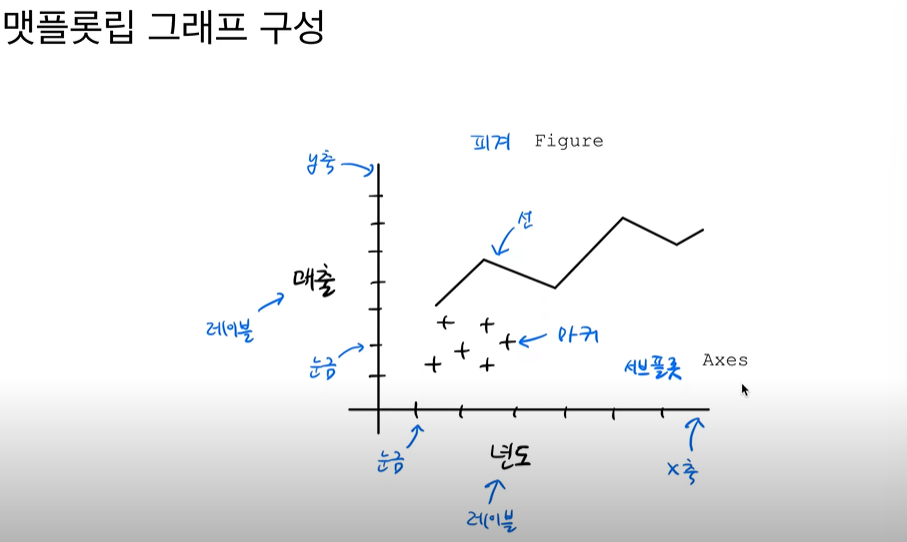
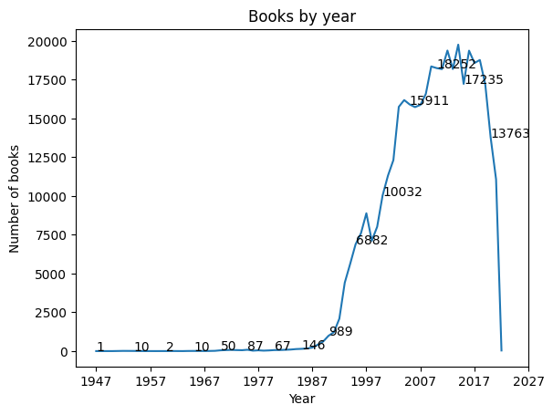
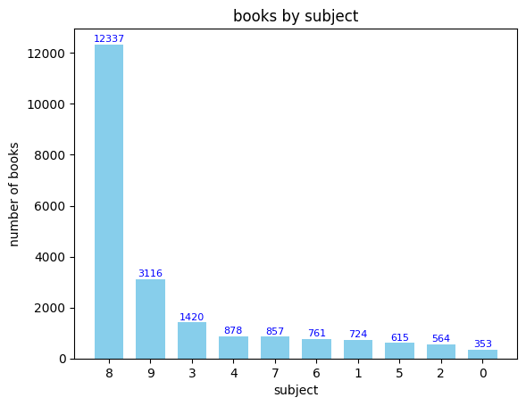

# 1강

- 데이터 과학은 "머신러닝, 통계학, 데이터 분석 , 데이터 마이닝" 을 포함한다

- 데이터 과학이란 문제 해결을 목적으로 하는 기술

<br>

---
    이 책의 목적은 프로그래밍 기술과 수학&통계를 이용한 데이터 분석을 목적으로 함. 

    이용도구: python(Colab),R 


<br>

# 2강 

- pandas 의 dataframe 자료구조를 활용하면 data를 table 형태로 볼 수 있음

<br>

# 3강 

*API의 활용*

- 프로그램 간 데이터 요청&전달을 위해 규칙(->API)이 필요

    EX. 웹 서버와 브라우저 간 웹 통신규악(HTTP)를 이용하여 약속된 웹페이지를 전송한다. 데이터도 웹 기반으로 주고받을 수 있음. 

- 주요 파일 형식은 JSON이나 xml. data를 받아 python에서 활용할 수 있는 객체로 바꾸기 위해 추가 처리가 필요하다.
    
    - python 의 requests, json 패키지

---
     API의 장점은 데이터베이스에 직접 접근하지 않고 원하는 데이터를 얻을 수 있다는 것. 데이터베이스의 접근권한 문제, 보안 문제 등을 해결 가능하다. 


<br>

# 4강 

*웹 스크래핑*

- 도서 쪽수 추출 실습
    1. yes24 검색창에서 책의 isbn으로 검색
    2. 위의 검색url을 request.get으로 추출
    3. 위의 추출된 데이터에서 도서 상세페이지 url 추출
        - 개발자 도구에서 태그 확인, beautifulsoup 패키지로 활용
    4. 위에서 추출된 url을 request.get으로 추출
    5. 위의 추출된 데이터에서 도서 쪽수 추출

- 스크래핑 시 주의할점
    - 웹사이트에서 스크래핑 허락? 
    - html 태그 특정여부
    - 페이지 동적(ajax) 생성여부
        - 원하는 내용이 html의 text에 나타나지 않을 수도 있음
        - 그 경우 고급 도구 필요 
    - 디자인 자주 변경되는지 


---
    스크래핑이 오작동하는 경우 빠르게 알아챌 수 있도록 코드를 작성해야함 


<br>

# 5강 

*데이터 정제*
 
 - 중복데이터를 해결하기 위한 메서드

 - groupby를 활용한 추가 분석 

---
    데이터의 일정한 정제 & 정제 과정 기록도 중요. 

<br>

# 6강 

*데이터 수정*

- fillna, replace 메서드 사용

---
    데이터에 이상한 문자 등이 섞인 경우 어떻게 처리할 것인지

<br>

# 7강 

*통계로 요약하기*

- fillna, replace 메서드 사용

- 분산이란 데이터가 얼마나 모여있는지 여부 

---
    '기술 통계'로 데이터의 통계를 내서 데이터를 설명하는 것 의미 

<br>

# 8강 

*분포로 요약하기*

- numpy 패키지로 통계적 요약 가능 

-  matplotlib 패키지 사용한 그래프 그리기 


---
    자료 특성에 따라 히스토그램, 산점도, 상자수염 그래프 등 선택적으로 결정할 수 있음

<br>

# 9강 

*데이터 시각화*

-  matplotlib 패키지 사용한 그래프 그리기 심화

* axes -> x-axis, y-axis 
* 단위는 xscale, yscale 


- 두개 이상의 그래프가 있으면 서브 플롯(또는 axes)가 두개 있다고 말함

---
    두개 이상의 그래프(서브플롯) 그려서 원하는 형태로 나열할 수 있음 


<br>

# 10강 

*선 그래프*

-  

-  

---
    범위 데이터는 선그래프가 보기 좋음
    카테고리 성격의 데이터는 막대그래프로 그리기, y축 값이 큰 것 부터 나열
    적절한 간격으로 데이터 값을 기입해주기 


<br>

# 11강 

*객체지향 API로 그래프 그리기*

- 산점도 그래프 그릴 때 활용할 수 있는 변수

```python
fig, ax = plt.subplots(figsize=(10,8))
# 산점도 x축 값은 문자열이 들어올 수 없음 
sc = ax.scatter(book['발행년도'],book['출판사'],
            linewidths=0.5, # 마커 테두리 선 너비 조정 
            edgecolors='k', # 마커 테두리를 블랙 
            alpha=0.3, # 마커 투명도
            cmap='jet', # 컬러 맵
            s=book['대출건수'], # s= 대출건수에 따라 마커 크기 크게 하는 변수
            c=book['대출건수'] # c= 마커 색상설정
            )
fig.colorbar(sc) # 컬러바 메서드에 전달하면 컬러바 그래프 같이 보임
```

---
    산점도 그래프의 마커 디자인을 위한 여러 변수가 존재
    생각보다 시각적으로 깔끔한 느낌은 아님

    산점도 그래프 그릴떄 x축에는 문자열 값이 올 수 없음 

<br>

# 12강
